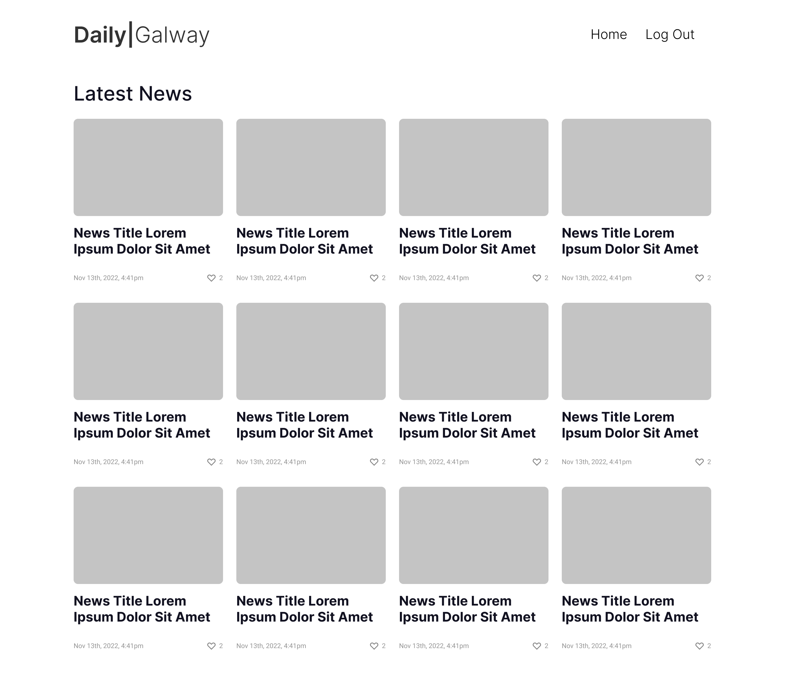
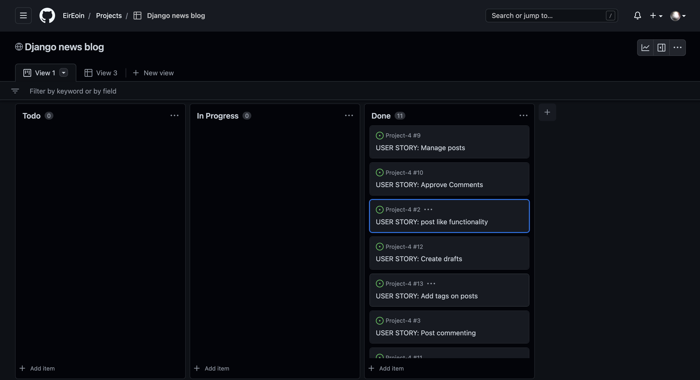
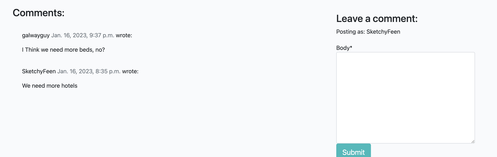
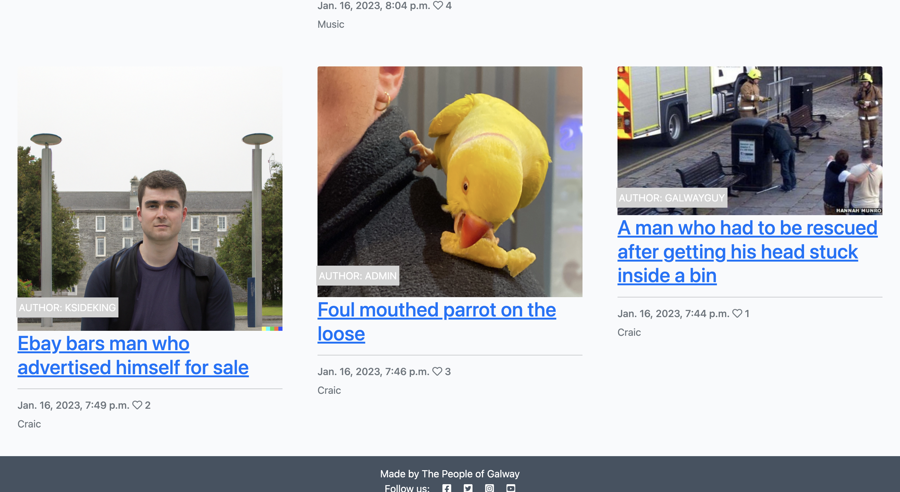
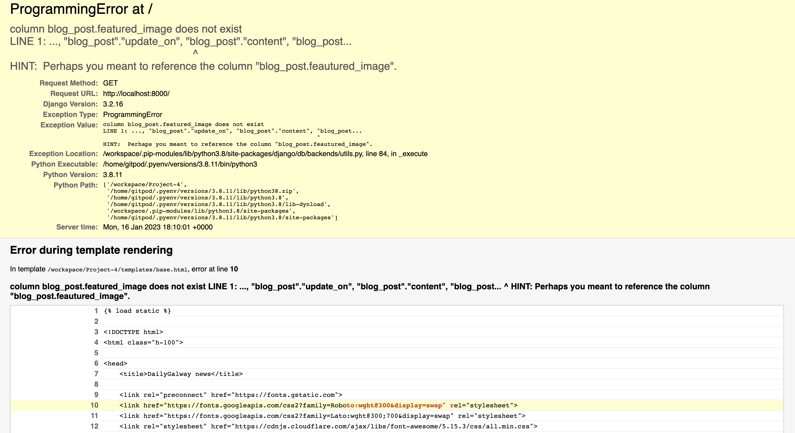
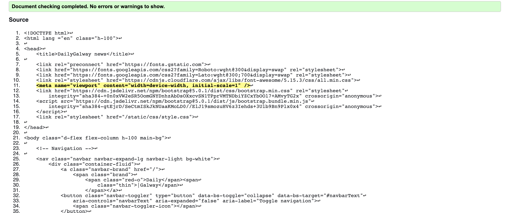
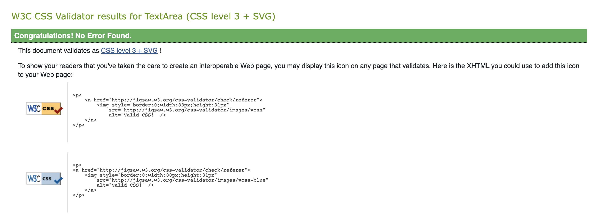
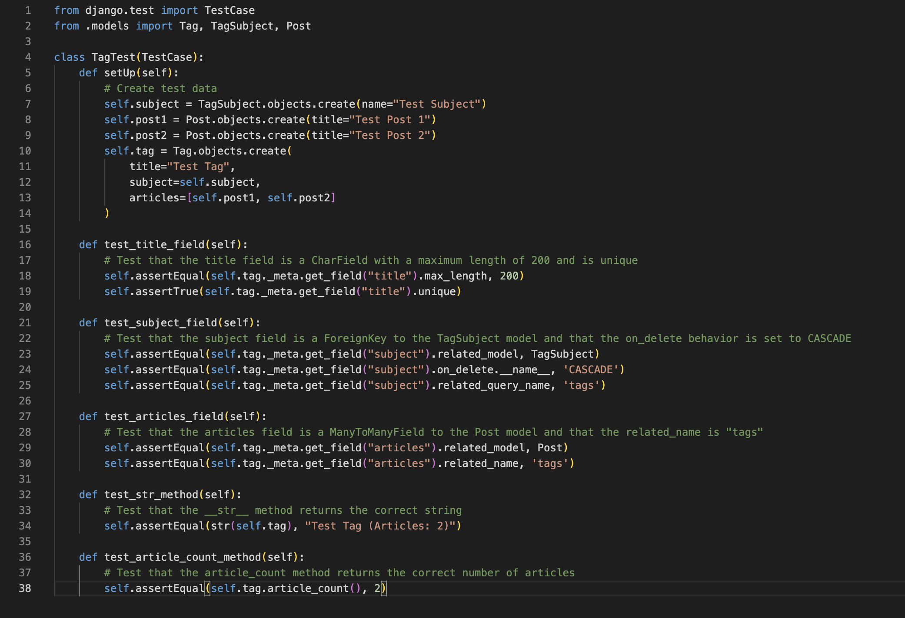
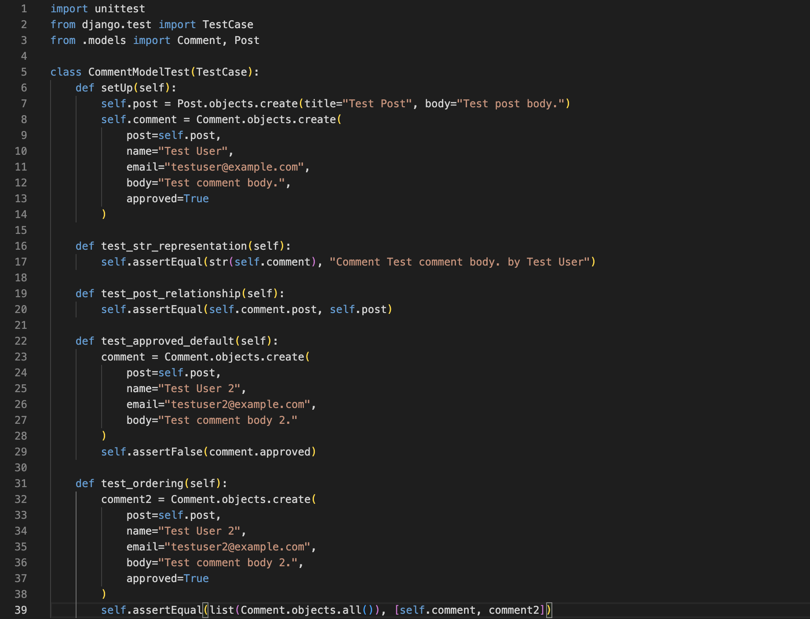

# DailyGalway 

## Who we are

I created DailyGalway with one thing in mind, to keep Galway connected. 
Since the Pandemic people have never felt so un-attached to their city. We at DailyGalway want one place for the people, made by the people. We listened to the People, The public even and took an Agile approach to this Community. We heard what the people wanted and listed them all in Github Projects to keep our eyes on the goals.
Throughout the whole process of building the site we were marking whats done , being done, currently and what's to-do. 
This process really kept us in line and driven to a beautiful end goal. 
To keep local topics, events and on-goings together online in one place. Users can post, comment and interact with the blog aswell as other users. We love what we have done and we hope to continue growing in this beautiful space. Go to Galway, Today! 

## How to use

Users that visit the beautiful, ad-free, clean site will be greeted with our DailyGalway homepage with our more recent articles. 
When a user decides to Sign Up they can click the Register button on the top left side of the homepage.

* Sign up 

* Interact with Posts

* Share your opinion

Users can also Like posts and leave comments on any articles posted.
Once a comment is made it is filtered through admin before posting to the site. We believe in a freedom of speech here but not bullying, racism or any harmful other material.
The User can also filter through Posts related through eachother from Tags. Each Article Posted has one or many tags in it.
The User can click on the tag and find articles of similar nature. Once we have a wider library of content This tool will be super handy for any user.

## Approach

### Design

My Design Thinking approach to building Daily Galway was focused on understanding the needs and pain points of our users. I began by conducting user research and interviews to gather insights on what features and functionality users were looking for in a news aggregation platform. I also looked at the current offerings in the market and identified areas where I could improve and innovate.

I used wireframes to experiment with different layouts, and to test ideas for how I wanted to present the content, how the navigation should work, and what elements should be included. This helped me to quickly iterate on different design options and identify the best approach for the website.

Once I had a solid wireframe in place, I added some creativity to it by experimenting with different visual elements such as typography, color scheme, and imagery. This helped to bring the wireframe to life and give it a more polished and professional appearance.

I also had user testing with the wireframes to gather feedback and evaluate the effectiveness of the design choices. I asked my housemates, friends and family to interact with what I created and let me learn from their behaviour. This allowed me to make data-driven decisions and ensure that the final product was tailored to meet the needs of our users.

The end result is a user-friendly and intuitive news platform that offers a personalized experience for users. With features such as user-generated content, voting, and commenting, I hope to create a community-driven platform where users can come together to discuss and share news.
I made sure to put the user at the center of our project by conducting user research and incorporating user feedback throughout the development process. By keeping the user's needs in mind and continually iterating on our design, I was able to create a product that was user-friendly and met the needs of our target audience.

### Agile

Using an Agile approach and Github Projects, I was able to effectively manage the website development project on my own.
I created a project board and added columns for To-Do, In Progress, and Done tasks, which allowed me to easily visualize the progress of my work and quickly identify any blockers or issues that needed to be addressed. I broke down my goals into smaller, manageable tasks and moved them across the project board as they were completed. This helped me stay on track and ensure that I was making progress towards my larger goals.

Additionally, using Github Projects allowed me to collaborate and communicate effectively even though I was working alone. I commented on tasks, added attachments and even found myself enjoying myself, even if the team was only me. This helped me keep myself on the same page and ensure that I was aware of what needed to be done next.

Overall, my approach using Github Projects and an Agile methodology was successful in helping me manage the website development project, stay organized and focused, and adapt to changes as the project progressed

## Admin use

Admins can log in using our Django Sign In page.
From there Admins can manage Posts, Comments, Tags and Tag Subjects.
Admins can decide whether comments should be posted or deleted and the same goes for Articles.
Admin positions are assigned to Galway heads that can be trusted, open-minded and approach the work very seriously and un-biased. Hopefully in the near future we can assign many people to roles in DailyGalway.

## Existing Features

* Viewing and browsing Articles

* Singing up and registering an account with a user created username

* Liking Posts 

* Unliking Posts 

* Commenting on Posts

* Tags on Posts to Categorise them

* Links to our Facebook, Instagram and Twitter

## Future Features 

* A Dislike Button

* Account Profile Pictures

* Account Connection through Facebook, Instagram, Google or Twitter

* Direct Messaging from account to account

* Author Archives to find all of their articles

## Bugs

When deploying this Project to Heroku I encountered many problems with connecting PostGres and fully connecting my repositiory to Heroku. I solved this problem by installing a few more requirements and importing correctly.
Indentation errors threw me back at first but finding them became easier throughout the build.
Migrating succesfully was also a problem but once I fixed a spelling mistake we were on our way.
When I turned DEBUG off before deployment, connection to my css was interuppted. I troubleshot that on google and found a small insert of code to what I thought fixed the problem in the settings.
I turns out I needed to Have DEBUG set to 'DEV' with an import attached so it can work with my css on github and on Heroku deployment.
After I got this fixed I noticed my image fields weren't loading correctly. 

The buttons on the Navbar did not work for registering or logging in but after a few tests we got them connecting correctly. The same issue came up when i turned DEBUG off.
The Comment section threw an error at me for a while but we got the sign in linked to it, aswell as a pop up that times out once a comment is made.

Heroku changed it terms of services to a paid service which caused some distruption, I had to use ElephantSQL as a database instead.

Upon Fixing Broken image field i realised I had a misspelling in my code which threw my whole operation askew. I misspelled featured_image and it was engrained in the database, so even after the correction of the spelling on nearly every piece of html, it still wouldn't work.

 I had to delete migrations and reset my Database to ressolve this error. It also costed me deleting the beautiful (imageless) Articles and post them again, even more beautiful. 

 Please note

In this project, the environment variables were previously exposed and have been changed for security reasons. As a result, a new Cloudinary account had to be created to get a new URL and make everything work again.

## Testing 

As a developer, I know how important it is to run tests and ensure that my HTML, CSS, and JavaScript code is error-free and meets industry standards. That's why I always make sure to run my code through validators before launching a project. Validators are tools that check the syntax and structure of my code to make sure it is correct and follows best practices. For HTML and CSS, I use the W3C Validator, which checks my code against the latest standards and guidelines. By running my code through these validators, I can be confident that my projects will be reliable and well-built, and that they will work seamlessly on any device or browser. Overall, running tests and using validators is an essential step in the development process and helps me deliver high-quality projects to my clients.
I only came across a few errors with my finished html, a majority of them were missing alt tags in my img tags. I was happy to see my CSS code ran through the validator with no problem!

### Tag class 

This test uses Django's built-in TestCase class to create and test instances of the Tag, TagSubject, and Post models. The setUp method is used to create test data that is used in the test methods. The test methods use various assertions to check that the fields and methods of the Tag class are working as expected.
The test case for the Tag model includes five test methods that check various aspects of the Tag model's implementation. The setUp method is run before each test method to set up the necessary objects for the test.

The first test method test_title_field checks that the title field is a CharField with a maximum length of 200 and that it is unique.

The second test method test_subject_field checks that the subject field is a ForeignKey to the TagSubject model and that the on_delete behavior is set to CASCADE. Also it check that the related_query_name is 'tags'.

The third test method test_articles_field checks that the articles field is a ManyToManyField to the Post model and that the related_name is "tags".

The fourth test method test_str_method checks that the __str__ method returns the correct string.

The fifth test method test_article_count_method checks that the article_count method returns the correct number of articles.

If all of these test methods pass, it suggests that the Tag model has been implemented correctly and meets the requirements specified in the test case.

### Comment class

In this  test case, I create an instance of the Post model, and use it to create an instance of the Comment model in the setUp method. Then, I tested the string representation of the Comment model, the relationship between the Comment and Post models, the default value of the approved field, and the ordering of Comment objects. The test case includes four test methods that check various aspects of the Comment model's implementation. The setUp method is run before each test method to set up the necessary objects for the test.

The first test method test_str_representation checks that the string representation of the Comment model is correct.

The second test method test_post_relationship checks that the relationship between the Comment and Post models is correct.

The third test method test_approved_default checks that the default value of the "approved" field is correct.

The fourth test method test_ordering checks that the ordering of the comments is correct.

If all of these test methods pass, it suggests that the Comment model has been implemented correctly and meets the requirements specified in the test case.

## Deployment 

The site was created using Github and deployed using heroku. The process began on github, connected my repository to heroku + PostGres and deployed on there too. One potential struggle was configuring the database. Heroku's terms of service have changed, so I needed to use ElephantSQL as a database, which was unfamiliar adn tricky at first. This required some additional setup and configuration, which took some time to figure out. Additionally, it required additional code changes to connect to the ElephantSQL database.
Another challenge I have faced while working with Heroku is dealing with error messages and debugging issues that can arise during the deployment process. This can be especially frustrating if the error messages are unclear or not specific enough to pinpoint the source of the problem. In these cases, it can be helpful to check the logs, do some research online, or ask for help from friends or online communities.
It took some altering and lot of trial and Error but we truly hope everyone enjoys our creation.
Overall, working with Heroku can be a rewarding experience, but it can also present some challenges, especially if you are new to the platform or working with unfamiliar technologies. By being prepared and willing to troubleshoot issues as they arise, you can successfully deploy your projects to Heroku and take advantage of its powerful features.

## Credits 

I used The Coding Institute lessons in The Agile Development, HTML, CSS, Python, Javascript, Django and Postgres to Build this project. I used w3schools.com for some help with functions and model builds. I browsed well populated and heavily user Reddit for inspiration. I also used PEP - 8 to work with Python and realpython.com with the testing. I also used Stackoverflow alot to troubleshoot any problems I have.
I used the Coding Institute Slack group for help Daily on this project, Thank you especially to everyone on there and to the tutor support that helped along the way!

## Media

all the images used for this project are either photos I have taken myself, created using AI or taken from a real news article such as RTE.